# Northline RP Community Portal


The community website for **Northline RP**, an [s&box](https://sbox.game) roleplay server running
[Northbound RP](https://sbox.game/apetavern/aperp) (ApeTavern's `aperp` gamemode).

The portal sits next to the game server and reads its JSON save files and logs. Players sign in with
Steam and get a dashboard, a public profile, a Twitter-style city feed, a forum that syncs with Discord,
leaderboards, guides, and a live server status page. Staff get a command center for the console,
moderation, applications, maintenance mode, Discord tools, and audits.

I built it over two weeks in May 2026, shipping 135 builds from v2.0 to v2.9.122. I no longer have time
to work on it, so I'm publishing it as a reference project. Every saved build is in this repo's history (see
[Version history](#version-history)), and `npm run demo` starts the whole site with a made-up city, no
game server needed.

**[Open the live demo](https://brocksexton.github.io/northline-rp-community-portal/)**. It's a static copy of the
demo city hosted on GitHub Pages. Use the switch in the bottom-left corner to browse as a guest or as a
signed-in Developer who can open the staff pages.

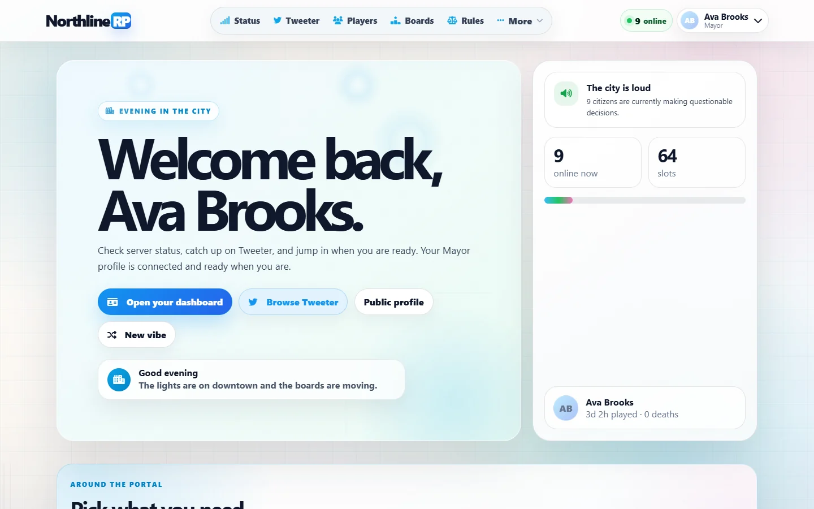

## Contents

- [Features](#features)
- [Screenshots](#screenshots)
- [Try the demo](#try-the-demo)
- [Running it for real](#running-it-for-real)
- [Make it yours](#make-it-yours)
- [Configuration reference](#configuration-reference)
- [Project layout](#project-layout)
- [Version history](#version-history)
- [Security notes](#security-notes)
- [Known issues](#known-issues)
- [Credits and trademarks](#credits-and-trademarks)
- [License](#license)

## Features

**For players**

- **Steam sign-in** (OpenID). A player's SteamID links them to their in-game save. The game stays the source of truth.
- **Homepage.** Staff-editable hero messages, live city stats, a "chaos board" of how people died, the newest Tweeter posts, and staff notices.
- **Server status.** Online state, who's in the city, joins and leaves over 24 hours, host metrics, and staff notices. It queries the game server directly (Source/A2S over UDP) and falls back to a heartbeat file or the connection logs.
- **Tweeter.** A Twitter-style city feed built from the game's in-game `tweeter.json`. It has threads, profiles, follows, likes, bookmarks, and website-only DMs, plus three layout eras (modern, retro, classic) and several color modes.
- **Profiles and the player directory.** A profile is created the first time a player signs in on the website, with a cover, theme, bio, and "showcase" toggles for economy, inventory, stats, properties, and activity. Profiles are listed publicly by default, but every showcase section starts off. Players can turn sections on or make the whole profile private.
- **Leaderboards.** Net worth, playtime, level, property builds, Tweeter activity, deaths, guide progress, and more. The money, playtime, stats, and property boards only include players who turned on that showcase section.
- **Forum.** Threads, replies, and emoji reactions. It syncs both ways with a Discord forum channel, and players can link their Discord account with a `/link` code.
- **Guides and rules.** Step-by-step job guides (police, courier, mayor and elections, and core basics) with in-game screenshots, plus a rules handbook that can sync its short rules into the game.
- **Dashboard.** Profile Studio, Discord connections, property layouts, the player's own activity log, a data export (a zip with an HTML viewer), and deletion requests.
- **Northbound Bank.** A private snapshot of wallet, bank, storage, and item value.
- **Daily Drops.** A free daily case with a website-side reward inventory.
- **Staff applications.** Job postings with guided application forms and status updates.
- **Public ban list.** Temporary bans update live, and each ban has a detail page with a sanitized timeline.
- **Dev blog** for release notes.

**For staff** (`/staff`)

- **Server control.** Tail the live console, see who's connected, and send kick, ban, and `say` commands. Start, stop, restart, and update the game server, and start or stop the Discord bot and the command bridge.
- **Status diagnostics.** Query attempts, process checks, metric history, and public notices.
- **Moderation.** Tweeter account restrictions, a word filter, and forum moderation that mirrors to Discord.
- **Site settings.** Feature toggles, homepage hero messages, and the ApeTavern badge list.
- **Maintenance mode** for the whole site, or just Tweeter, with its own look and countdown.
- **Staff workspaces:** application review, Daily Drops setup, and a Discord manager (embed builder, roles, timeouts).
- **Staff audit.** Sign-in gaps, actions per staff member, and per-page access overrides.
- **Privacy queue.** Export and deletion requests.

**Integrations**

- **Discord bot** (`discord.js`). It adds slash commands for status, players, guides, jobs, and moderation. It can also post join, leave, and death notices, show a live player count as its status, handle forum sync, and give a role when an account is linked.
- **Server command bridge.** It launches the game server, writes its console to a log file, and feeds queued website commands to the server's stdin.
- **Discord webhooks** for status notices, new registrations, admin audit, and server actions.

## Screenshots

Every name, post, and number below is made up. It all comes from [`demo/seed.mjs`](demo/seed.mjs).

| | |
|---|---|
| 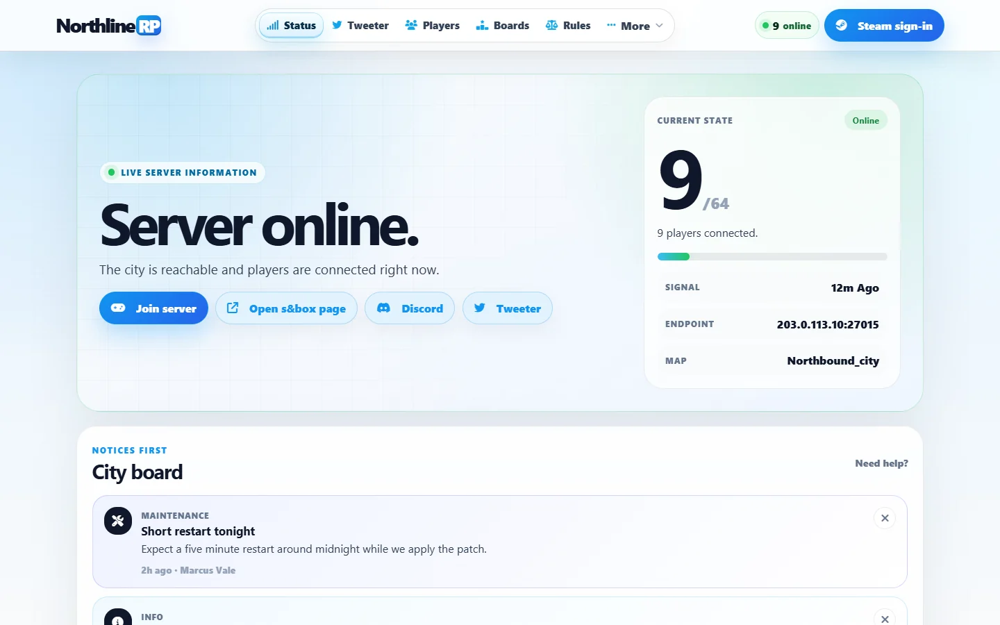 **Server status** with live population and staff notices | 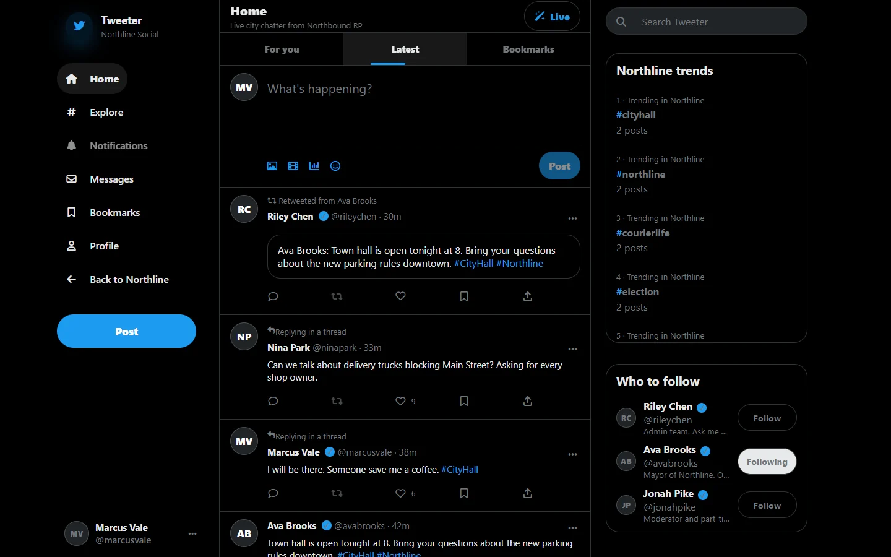 **Tweeter**, the in-game social feed on the web |
| 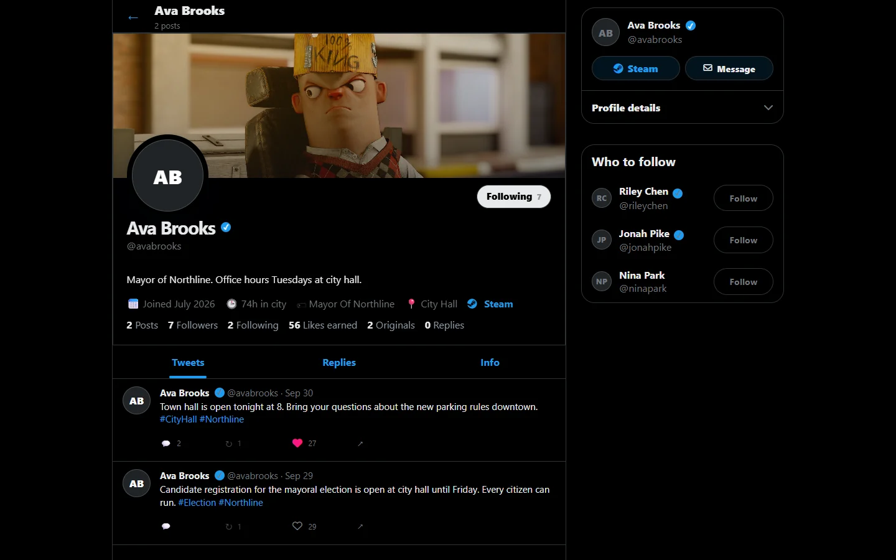 **Tweeter profile** with cover, stats, and follows | 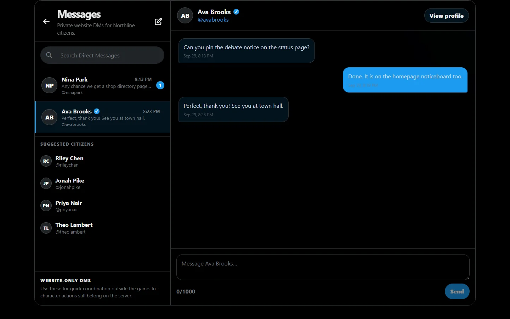 **Website DMs** between citizens |
| 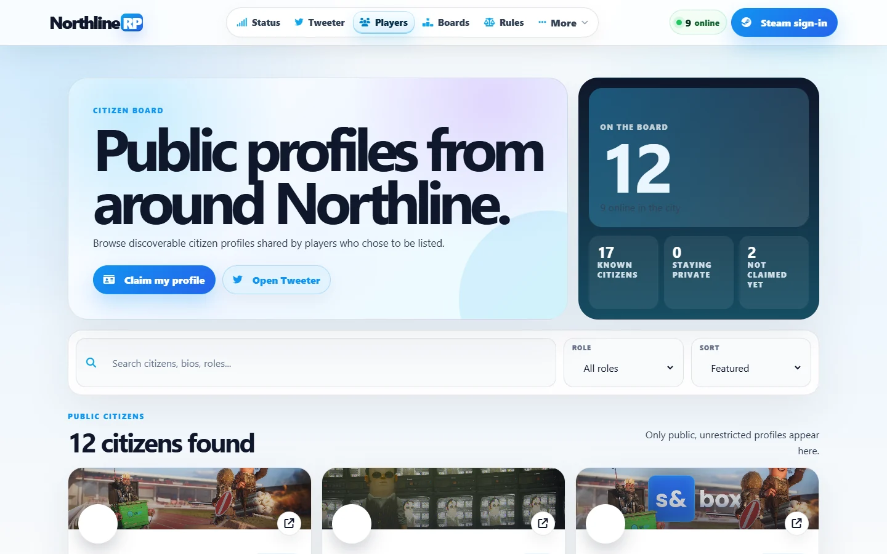 **Player directory** (opt-in public profiles) | 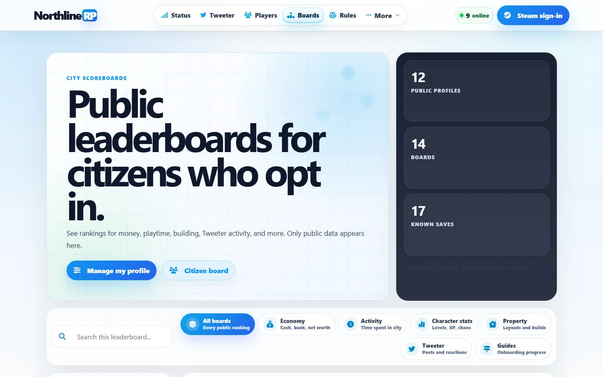 **Leaderboards** across 14 boards |
| 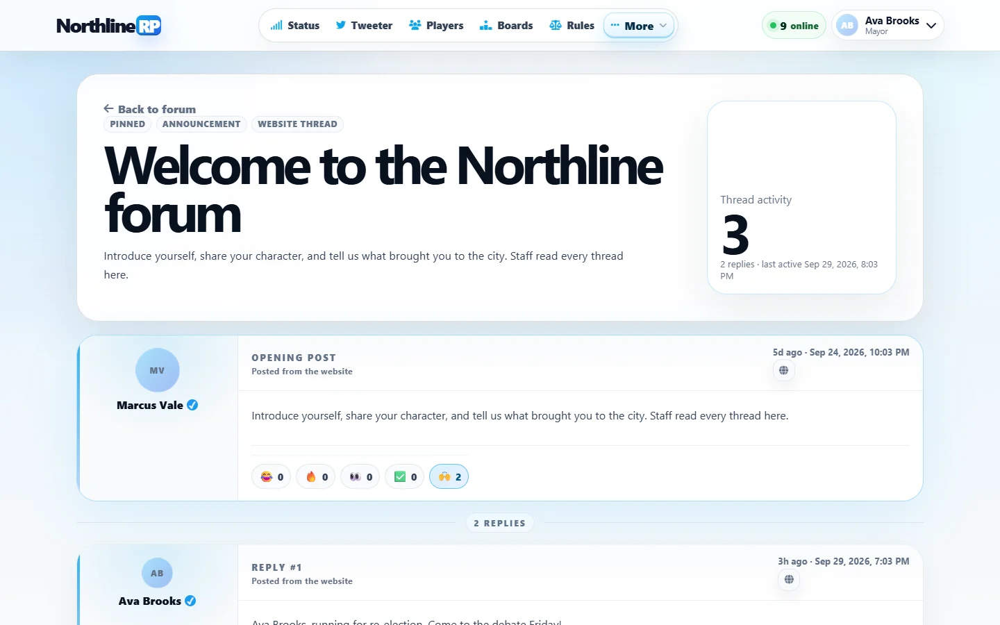 **Forum** thread with emoji reactions | 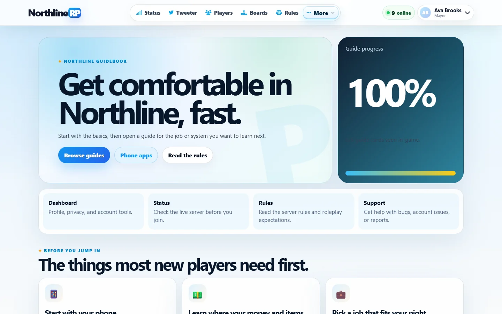 **Guides** with onboarding progress |
| 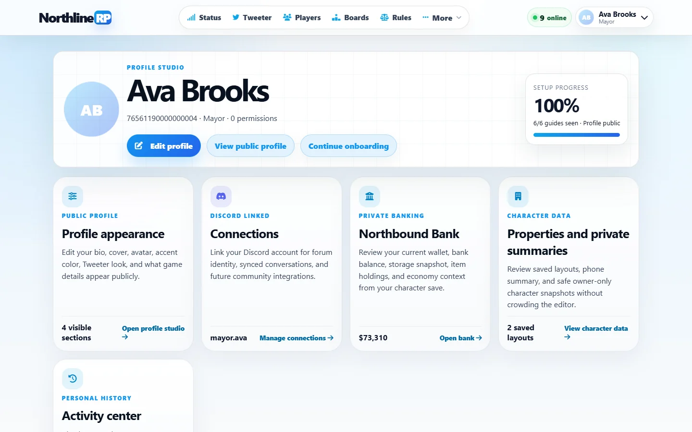 **Dashboard** (Profile Studio) | 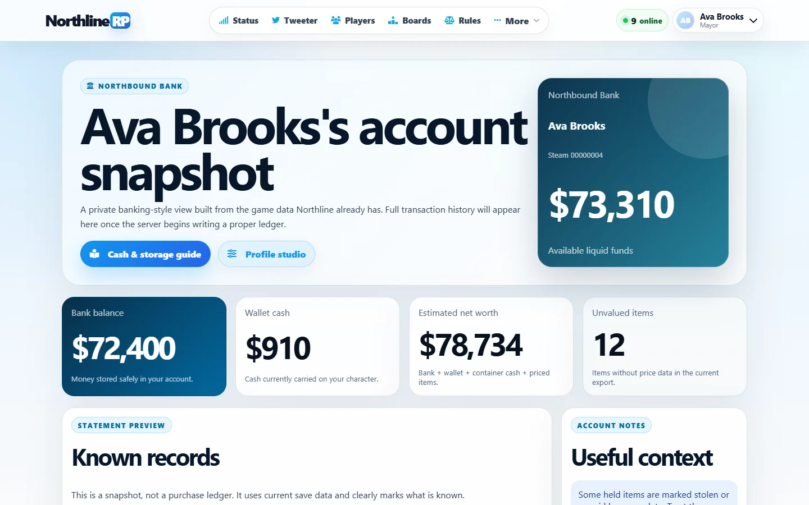 **Northbound Bank** snapshot |
| 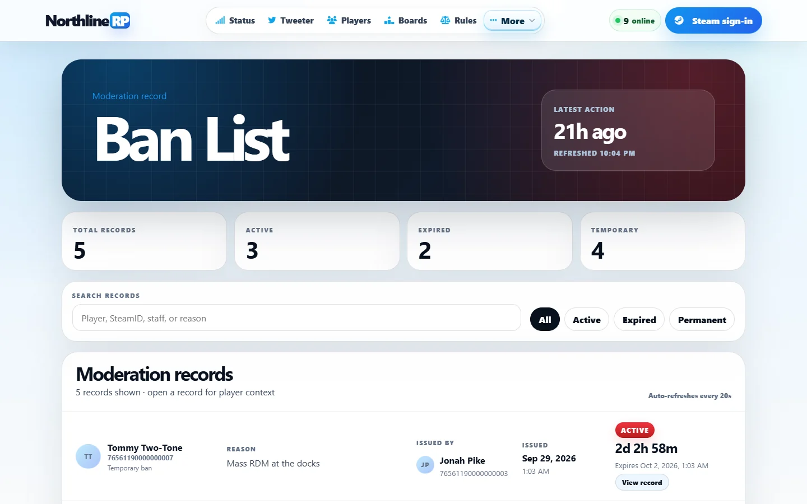 **Public ban list** with live temporary bans | 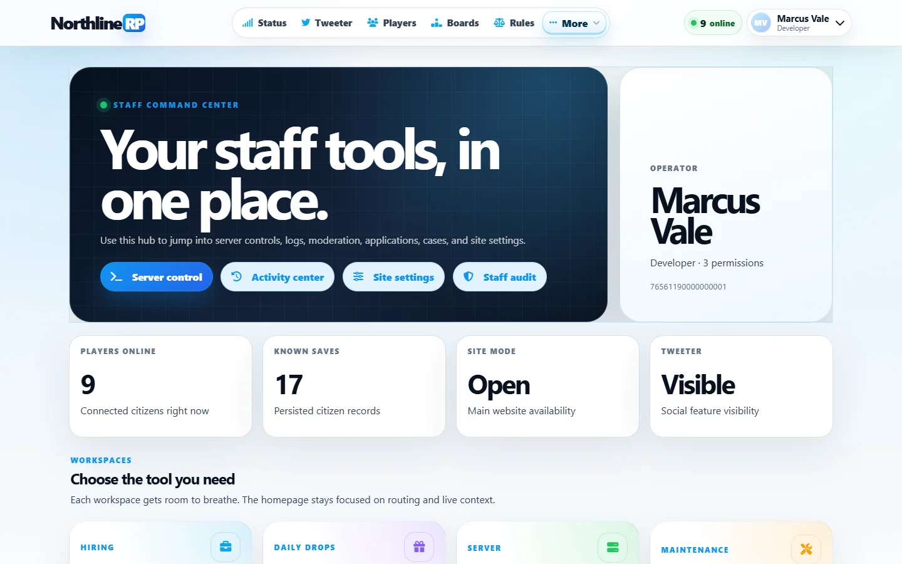 **Staff command center** |
| 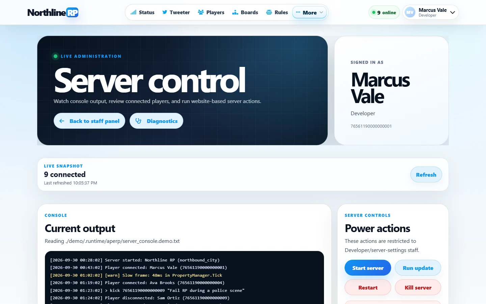 **Server control**: console, roster, power actions | 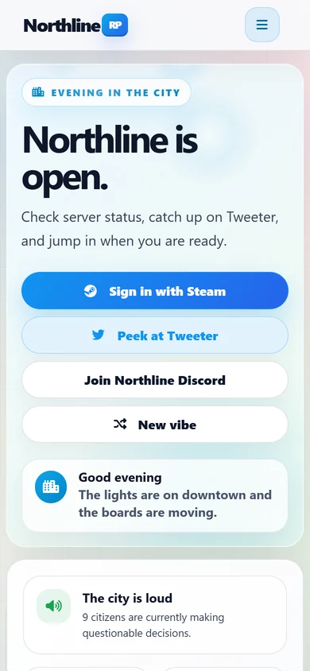 **Mobile** homepage |

<details>
<summary>Full homepage (signed in)</summary>

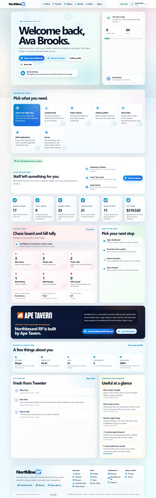

</details>

## Try the demo

### Online

The [live demo](https://brocksexton.github.io/northline-rp-community-portal/) is a snapshot of `npm run demo`,
published to GitHub Pages. Every page and the sample data are there, menus and tabs work, and you can
switch between a guest and a signed-in Developer (Marcus Vale) in the bottom-left corner. Because GitHub
Pages only serves files, nothing you do is saved (likes, posts, and staff buttons show a notice), and the
clock is pinned to the moment the snapshot was taken, so "online now" and "5 minutes ago" stay put.

### On your computer

You need Node.js 20.11 or newer. Nothing else is required: no game server, Steam API key, or Discord bot.

```bash
git clone https://github.com/brocksexton/northline-rp-community-portal.git
cd northline-rp-community-portal
npm install
npm run demo
```

Open <http://localhost:3000>. Then:

1. Browse the public pages as a guest.
2. To sign in, click **Dev login** on `/dashboard`, or open <http://localhost:3000/api/auth/steam?dev=1>.
   You'll be signed in as **Marcus Vale**, a Developer who can open every staff page.
3. To see a regular citizen's view, set `DEV_STEAM_ID` in [`demo/.env.demo`](demo/.env.demo) to another
   persona, restart `npm run demo`, and open <http://localhost:3000/api/auth/steam?dev=1> again. The Dev login
   button only appears when you're signed out.

| Persona | SteamID | Role |
|---|---|---|
| Marcus Vale | `76561190000000001` | Developer (full staff access) |
| Riley Chen | `76561190000000002` | Admin |
| Jonah Pike | `76561190000000003` | Moderator |
| Ava Brooks | `76561190000000004` | Mayor (citizen view with a verified badge) |
| Dex Moreno | `76561190000000005` | Regular citizen |

How the demo works:

- `demo/seed.mjs` builds a fictional city of 17 citizens in `demo/.runtime/`, which is gitignored. It writes game files (saves, roles, Tweeter posts, connection, chat, admin, and damage logs, bans, property layouts) and website files (profiles, follows, DMs, forum threads, job applications, and more).
- Timestamps are relative to the moment you run it, so run `npm run demo` or `npm run demo:seed` again whenever you want fresh "online now" data. Each run also resets anything you clicked.
- The demo SteamIDs sit below Steam's real account range, so none of them belong to a real person.
- [`demo/.env.demo`](demo/.env.demo) is loaded with `node --env-file`, which takes priority over any `.env.local` you have. It turns off the Steam Web API (names and avatars) and every Discord integration, sends the server status query to an empty local port (so the status comes from the seeded heartbeat file), and points the power buttons at scripts that don't exist.
- The **Steam sign-in** button still goes to real Steam. Use the dev login instead.
- The demo server only listens on `127.0.0.1`.

> [!WARNING]
> `demo/.env.demo` turns on the dev login and uses a signing key that is public. Never use it for a real deployment.

### Rebuilding the online demo

```bash
npm run demo:static                # writes static-demo-out/
npm run demo:static -- --publish   # also commits it to the gh-pages branch and pushes
```

[`scripts/static-demo/build.mjs`](scripts/static-demo/build.mjs) makes a production build for each view (guest
and signed-in), serves it with the demo data, crawls every page, and saves the HTML, the Next.js router
payloads, and the `/api` responses the pages ask for. [`scripts/static-demo/shim.js`](scripts/static-demo/shim.js)
is added to every page. It answers those requests from the saved files, keeps links inside the
`/northline-rp-community-portal/` sub-path, pins the clock, and draws the view switcher. The build needs
Google Chrome or Microsoft Edge installed. It takes about ten minutes.

## Running it for real

### Requirements

- Node.js 20.11+ and npm 10+.
- The Northbound RP data folder: the one that directly contains `player_save_data.json`. The site needs read access to it.
- A public HTTPS URL for Steam sign-in, which needs a reachable callback. The original deployment used [Caddy](https://caddyserver.com) behind Cloudflare, on the same Windows machine as the game server.

### Install and configure

```powershell
npm install
copy .env.example .env.local
notepad .env.local
```

The minimum `.env.local`:

```dotenv
SITE_URL=https://your-domain.example
NEXT_PUBLIC_SITE_URL=https://your-domain.example
APE_RP_DATA_PATH=C:\Servers\aperp            # folder containing player_save_data.json
NORTHLINE_DATA_PATH=C:\Servers\northline-data # the website's own data (profiles, forum, DMs, ...)
SESSION_SECRET=<a long random string>         # production won't sign sessions without it; changing it logs everyone out
STEAM_API_KEY=                                # optional, enables Steam names and avatars
ENABLE_DEV_STEAM_LOGIN=false
```

To generate a session secret in PowerShell, run `[Convert]::ToBase64String((1..48 | ForEach-Object { Get-Random -Maximum 256 }))`.

Then edit [`config/site.config.json`](config/site.config.json) to set the branding, the Discord invite, the
legal contact email, and **`status.serverHost` / `status.serverPort`**. The server host in this repo is a
placeholder (`203.0.113.10`, an address reserved for documentation), so the status page can't reach any
server until you change it.

### Build and start

```powershell
npm run build   # or scripts\build-production.ps1 (install + typecheck + build)
npm run start   # binds 127.0.0.1:3000 for the reverse proxy
```

Put a reverse proxy in front ([`Caddyfile.example`](Caddyfile.example) shows how). Steam sign-in builds its
callback from `SITE_URL` (`https://your-domain/api/auth/steam/callback`). The forwarded headers are only a
fallback when `SITE_URL` is unset, and they give rate limiting the real client IP.
See [`docs/WINDOWS_DEPLOY.md`](docs/WINDOWS_DEPLOY.md) for the original install and update commands and
[`docs/AUTH_TROUBLESHOOTING.md`](docs/AUTH_TROUBLESHOOTING.md) for cookie and proxy problems, including
Cloudflare cache rules.

### Who counts as staff

Staff access comes from the game's own role files, not from website settings:

- `roles.json` defines roles and their permissions.
- `player_roles.json` assigns a role to a SteamID.
- A role named `Developer`, `Admin`, or `Moderator`, or a role with the `AdminTools`, `ViewLogs`, or `ModifyServerSettings` permission, opens `/staff`.
- `Developer` gets everything, including server power actions, site settings, and bypassing maintenance mode.
- Individual staff pages can be turned off per person from `/staff/audit`.
- SteamIDs on the ApeTavern badge list only get a badge. They can never open `/staff`, even with a staff role. The list is edited in `/staff/site`, starts with nine IDs from `lib/ape-staff-shared.ts`, and goes back to those defaults if you empty it.

### Discord bot and server bridge (optional)

```powershell
npm run bot:register   # register slash commands (DISCORD_BOT_TOKEN, DISCORD_BOT_CLIENT_ID, optional DISCORD_BOT_GUILD_ID)
npm run bot:start      # run the bot (DISCORD_BOT_TOKEN, NORTHLINE_BOT_API_SECRET of 24+ characters)
npm run server:bridge  # launch the game server and relay queued console commands
npm run rules:sync     # copy config/server-rules.json into the game's server_config.json
```

The bot and the bridge can also be started and stopped from `/staff/server`. Setup guides are in
[`docs/discord-bot.md`](docs/discord-bot.md),
[`docs/bot-secret-and-command-bridge.md`](docs/bot-secret-and-command-bridge.md),
[`docs/FORUM_DISCORD_BRIDGE.md`](docs/FORUM_DISCORD_BRIDGE.md),
[`docs/DISCORD_BOT_MANAGER.md`](docs/DISCORD_BOT_MANAGER.md) and
[`docs/discord-webhooks.md`](docs/discord-webhooks.md).

## Make it yours

The code is written for Northline RP. To run it for your own server, change the items below. Every
feature past the basic site is optional, and if you leave a setting blank, that feature stays off.

> [!CAUTION]
> The exception is the server buttons on `/staff/server`. Without `NORTHLINE_START_SERVER_SCRIPT`,
> `NORTHLINE_UPDATE_SERVER_SCRIPT`, and `NORTHLINE_SERVER_PROCESS_NAMES`, they use Northline's own
> `C:\Servers\Scripts\...` paths and **Kill** runs `taskkill /F` on any `sbox.exe`. Set all three before
> you give anyone the Developer role.

### 1. `config/site.config.json`

| Key | What to put there |
|---|---|
| `brand.name`, `brand.tagline`, `brand.accentColor`, `brand.siteUrl`, `brand.embedImageUrl` | Site name, tagline, accent color, public URL, and link-preview image (the current one is an expired Discord link) |
| `server.discordUrl`, `server.joinUrl` | Your Discord invite, and your s&box game page (shown on `/status`) |
| `server.maxPlayersFallback` | Player cap shown when the server doesn't report one |
| `status.serverHost`, `status.serverPort` | Your game server's public address. It is set to `203.0.113.10`, a placeholder that doesn't reach any server. |
| `status.processNames`, `status.offlineAfterMinutes` | Process names for the "is the server running" check, and how old a heartbeat can be before the server counts as offline |
| `legal.contactEmail`, `legal.lastModified` | The contact address and date on the privacy and terms pages |

The file also has `home`, `content`, `features`, `quickLinks`, `brand.shortName`, `brand.domain`,
`server.locationLabel`, `server.modeLabel`, and `legal.*Sections`, but no page reads them yet. That text is
written into the pages themselves (see section 4).

### 2. `.env.local`: what each feature needs

| Feature | Set these |
|---|---|
| The site itself | `APE_RP_DATA_PATH`, `NORTHLINE_DATA_PATH`, `SESSION_SECRET` |
| Steam sign-in | `SITE_URL` and `NEXT_PUBLIC_SITE_URL`: your public `https://` URL, reachable by Steam |
| Steam names and avatars | `STEAM_API_KEY` ([get one here](https://steamcommunity.com/dev/apikey)) |
| Accurate server status | `status.*` in the config, or `NORTHLINE_SERVER_QUERY_HOST` / `_PORT`. You can also have the game write a `server_status.json` heartbeat ([format](docs/server-status-heartbeat.md)). |
| Staff console view | `NORTHLINE_SERVER_CONSOLE_LOG_PATH`, the file your server's console output goes to |
| Staff kick, ban, and say | `NORTHLINE_CONSOLE_COMMAND_SCRIPT`, or run the command bridge (next row) |
| Command bridge | `NORTHLINE_START_SERVER_SCRIPT` and `NORTHLINE_SERVER_COMMAND_QUEUE_PATH`, then `npm run server:bridge` (or start it from `/staff/server`). Set `NORTHLINE_SERVER_BRIDGE_SCRIPT` if you want the Start and Restart buttons to launch the server through the bridge. |
| Start, stop, restart, and update buttons | `NORTHLINE_START_SERVER_SCRIPT`, `NORTHLINE_UPDATE_SERVER_SCRIPT`, `NORTHLINE_SERVER_PROCESS_NAMES` |
| Discord bot | `DISCORD_BOT_TOKEN`, `DISCORD_BOT_CLIENT_ID`, `DISCORD_BOT_GUILD_ID`, `NORTHLINE_BOT_API_SECRET` (24+ characters), `NORTHLINE_BOT_API_BASE_URL`, then run `npm run bot:register` and `npm run bot:start` |
| Bot command permissions | `NORTHLINE_BOT_ADMIN_ROLE_IDS`, `NORTHLINE_BOT_MOD_ROLE_IDS`, `NORTHLINE_BOT_ANNOUNCE_ROLE_IDS` (comma-separated Discord role IDs) |
| `/staff/discord` manager | `DISCORD_BOT_TOKEN` and `NORTHLINE_DISCORD_GUILD_ID` |
| Forum and Discord sync | The bot token and `NORTHLINE_DISCORD_FORUM_CHANNEL_ID`, with the bot running. Turn on **Message Content Intent** in the Discord Developer Portal, and give the bot Manage Messages and Manage Threads in the forum channel. |
| A role for linked Discord accounts | `NORTHLINE_DISCORD_LINKED_ROLE_ID` and `NORTHLINE_DISCORD_GUILD_ID`, and turn on **Server Members Intent** |
| Join, leave, and death notices | `NORTHLINE_BOT_CONNECTION_NOTICES=true` with `NORTHLINE_BOT_CONNECTION_CHANNEL_ID`, and/or `NORTHLINE_BOT_DEATH_NOTICES=true` with `NORTHLINE_BOT_DEATH_CHANNEL_ID`. The bot also needs to read the console log (`NORTHLINE_BOT_CONNECTION_LOG_PATH`). |
| Bot status line | `NORTHLINE_BOT_STATUS_*` |
| Webhook notices | `DISCORD_WEBHOOK_STATUS_NOTIFIER`, `_NEW_REGISTRATION`, `_ADMIN_AUDIT`, `_WEB_ACTION`, `_GAME_ACTION` |
| Death events sent by the game | `NORTHLINE_GAME_EVENT_SECRET` (but see [Known issues](#known-issues)) |

### 3. In the game's data folder

Staff are the SteamIDs you give a staff role in `player_roles.json`. Roles and their permissions are
defined in `roles.json` (see [Who counts as staff](#who-counts-as-staff)).

### 4. In the code and content

These Northline-specific values live in code, not in config:

- **Links and branding:** `components/Footer.tsx`, `app/page.tsx`, and `app/support/page.tsx` link to the Northbound RP Discord, and `app/page.tsx` has the ApeTavern callout banner. The footer disclaimer is in `components/Footer.tsx`.
- **Legal copy:** the privacy and terms text is written in `app/legal/privacy/page.tsx` and `app/legal/terms/page.tsx`, and the privacy page names `northline.lol`.
- **Fallback domain:** `lib/site-config.ts`, `lib/embed-metadata.ts`, `lib/discord-manager.ts`, and `components/DiscordBotManagerPanel.tsx` use `northline.lol` when nothing is configured. The bot's `{site}` status placeholder is hard-coded in `scripts/discord-bot/bot.mjs`.
- **ApeTavern staff badge:** the default SteamIDs are in `lib/ape-staff-shared.ts`. Edit the list from `/staff/site`, which saves it to `ape-tavern-staff.json`.
- **Rules, guides, and dev blog:** `config/server-rules.json`, `app/rules`, `app/guides` with the screenshots in `public/guides/`, and `content/dev-blog/`.
- **Windows paths:** `scripts/shared/load-env.mjs` looks for env files in `C:\Servers\web` first, which is where the site was installed, and [`docs/WINDOWS_DEPLOY.md`](docs/WINDOWS_DEPLOY.md) uses the same layout. `lib/server-admin.ts`, `scripts/discord-bot/bot.mjs`, and `scripts/server-bridge/command-bridge.mjs` fall back to `C:\Servers\Scripts\` and `C:\Servers\northline-data\` when their path variables are blank.

## Configuration reference

[`.env.example`](.env.example) lists and comments most variables. The ones it leaves out are noted below and
under [Known issues](#known-issues). The main groups:

| Group | Variables |
|---|---|
| Core | `SITE_URL`, `NEXT_PUBLIC_SITE_URL`, `APE_RP_DATA_PATH`, `NORTHLINE_DATA_PATH`, `SESSION_SECRET`, `STEAM_API_KEY`, `ENABLE_DEV_STEAM_LOGIN`, `DEV_STEAM_ID` |
| Status query | `NORTHLINE_SERVER_QUERY_HOST`, `NORTHLINE_SERVER_QUERY_PORT`, `NORTHLINE_SERVER_QUERY_TIMEOUT_MS` (250–5000), `NORTHLINE_SERVER_QUERY_FALLBACK_HOSTS`. If unset, the site uses `status.*` in `config/site.config.json`. These aren't in `.env.example`, but [`docs/server-status-heartbeat.md`](docs/server-status-heartbeat.md) covers the first three. |
| Server admin | `NORTHLINE_SERVER_CONSOLE_LOG_PATH`, `NORTHLINE_SERVER_COMMAND_QUEUE_PATH`, `NORTHLINE_CONSOLE_COMMAND_SCRIPT`, `NORTHLINE_START_SERVER_SCRIPT`, `NORTHLINE_UPDATE_SERVER_SCRIPT`, `NORTHLINE_SERVER_PROCESS_NAMES`, `NORTHLINE_SERVER_BRIDGE_SCRIPT`, `NORTHLINE_SERVER_BRIDGE_LOG_PATH` |
| Bridge | `NORTHLINE_BRIDGE_SKIP_EXISTING_QUEUE_ON_FIRST_RUN`, `NORTHLINE_BRIDGE_EXIT_WITH_SERVER`, `NORTHLINE_BRIDGE_RETRY_SERVER_LAUNCH`, `NORTHLINE_BRIDGE_RETRY_SERVER_LAUNCH_MS` (also used but not in `.env.example`: `NORTHLINE_BRIDGE_LAUNCH_SERVER`, `NORTHLINE_BRIDGE_POLL_MS`, `NORTHLINE_SERVER_BRIDGE_STATE_PATH`) |
| Discord bot | `DISCORD_BOT_TOKEN`, `DISCORD_BOT_CLIENT_ID`, `DISCORD_BOT_GUILD_ID`, `NORTHLINE_BOT_API_SECRET`, `NORTHLINE_BOT_API_BASE_URL`, role gates `NORTHLINE_BOT_{ADMIN,MOD,ANNOUNCE}_ROLE_IDS`, `NORTHLINE_BOT_STATUS_*`, `NORTHLINE_BOT_CONNECTION_*`, `NORTHLINE_BOT_DEATH_*` |
| Forum and Discord | `NORTHLINE_DISCORD_GUILD_ID`, `NORTHLINE_DISCORD_FORUM_CHANNEL_ID`, `NORTHLINE_DISCORD_LINKED_ROLE_ID`, `NORTHLINE_BOT_FORUM_SYNC_ENABLED`, `NORTHLINE_BOT_FORUM_IMPORT_UNLINKED` |
| Webhooks | `DISCORD_WEBHOOK_STATUS_NOTIFIER`, `DISCORD_WEBHOOK_NEW_REGISTRATION`, `DISCORD_WEBHOOK_ADMIN_AUDIT`, `DISCORD_WEBHOOK_WEB_ACTION`, `DISCORD_WEBHOOK_GAME_ACTION` |
| Game events | `NORTHLINE_GAME_EVENT_SECRET` (falls back to `NORTHLINE_BOT_API_SECRET`) |

<details>
<summary>Files the site reads from the game folder (<code>APE_RP_DATA_PATH</code>)</summary>

| File | Used for |
|---|---|
| `player_save_data.json` | Citizens: names, money, level, playtime, inventory, stats |
| `roles.json`, `player_roles.json` | Roles, permissions, staff access, verified badges |
| `tweeter.json` | The Tweeter feed (`{ Tweets, Likes }`) |
| `server_config.json` | Max players, map, tax rate, item prices |
| `server_status.json` | Optional heartbeat ([format](docs/server-status-heartbeat.md)) |
| `blacklist.json`, `warnings.json`, `mutes.json` | Ban list and ban timelines |
| `guides_seen.json` | Guide progress |
| `connection_logs/*.json` | Who is online, joins and leaves, population trends |
| `chat_logs/*.json`, `admin_logs/*.json`, `damage_logs/*.json` | Staff activity, bans from admin logs, death stats |
| `property_layouts/<steamId>.json` | Property layouts and leaderboards |
| `phone_messages/<steamId>.json` | Message *counts* only (bodies are never shown) |
| `whitelist.json`, `scheduled_server_messages.json` | City overview counts |
| `server_console.log`, `console.log`, `logs/*.log` | Console fallback when `NORTHLINE_SERVER_CONSOLE_LOG_PATH` is unset |

Every log file is a JSON array. The site writes into this folder in two places: the staff "reset runtime"
action writes `status_runtime_reset.json`, and `npm run rules:sync` updates `server_config.json`. For exact
field shapes, [`demo/seed.mjs`](demo/seed.mjs) is a working example of every file.

</details>

<details>
<summary>Files the website keeps in <code>NORTHLINE_DATA_PATH</code></summary>

`community-store.json` (profiles, status notices, metrics), `tweeter-social-store.json` (follows, DMs,
bookmarks), `tweeter-moderation-store.json`, `tweeter-content-filter-store.json`, `forum.json`,
`job-portal.json`, `daily-cases-store.json`, `daily-cases-config.json`, `site-features.json`,
`site-maintenance.json`, `home-hero-messages.json`, `ape-tavern-staff.json`, `staff-website-signins.jsonl`,
`staff-access-overrides.json`, `privacy-requests.json`, `server-command-queue.jsonl`, `death-events.jsonl`,
plus logs, PID files, small state files (`server-game-action-monitor.json`, `server-population-reset.json`,
`server-command-bridge-state.json`), and `.cmd` launcher scripts for the processes the site starts. If
`NORTHLINE_DATA_PATH` is unset, everything goes in `.northline-data/` in the project folder. Every file is
optional and gets created with defaults on first use.

</details>

## Project layout

```text
app/                 Next.js App Router pages and API routes
  api/               JSON endpoints (auth, status, tweeter, forum, jobs, staff/*, bot/*, game-events/*)
  staff/             Staff command center pages
  tweeter/           Tweeter, with its own layout and themes
components/          React components
lib/                 Data access and domain logic (ape-data.ts reads the game files)
config/              site.config.json (branding, links, status host) and server-rules.json
content/dev-blog/    Markdown release notes shown at /dev-blog
docs/                Setup guides and per-version notes
scripts/             Discord bot, server bridge, rules sync, Windows build/start scripts
public/              Guide screenshots, badges, icons
demo/                Sample-data generator and demo environment
middleware.ts        Security headers, rate limiting, same-origin checks for API writes
```

There is no database: every store is a JSON or JSONL file.

## Version history

Each commit in this repo is one build of the portal, exactly as I shipped it, dated when it was built and
tagged with its version number (`v2.0` … `v2.9.122`). The messages summarize what changed in each build.
Some version numbers are missing because those builds were never saved.

```bash
git log --oneline --reverse    # the whole progression
git checkout v2.6.0            # run any earlier build
```

| Builds | What happened |
|---|---|
| v2.0 – v2.2.1 | Rebuild as Northline RP: Steam sign-in, dashboard, status, ban list, and Tweeter with threads, profiles, and likes |
| v2.4 – v2.5.4 | One shared profile for the website and Tweeter, opt-in showcases, Tweeter layout eras and color modes |
| v2.6.0 – v2.6.9 | Main site redesign, community homepage with city stats, rules handbook, player directory, sign-in stability |
| v2.7.1 – v2.8.8 | Guides hub, ban detail pages, profile covers, Profile Studio, legal and support overhaul |
| v2.9.1 – v2.9.7 | Leaderboards, Daily Drops, maintenance mode |
| v2.9.8 – v2.9.20 | Tweeter follows, DMs, moderation, content filter, link embeds |
| v2.9.21 – v2.9.30 | Live server query, host metrics, staff status studio, feature toggles, webhooks, dev blog |
| v2.9.32 – v2.9.49 | Server control console, Discord bot, command bridge, join, leave, and death notices |
| v2.9.50 – v2.9.66 | Staff applications, staff workspaces, homepage rework, Staff Command Center |
| v2.9.67 – v2.9.90 | Forum with two-way Discord sync, Discord manager, staff audit, data export and deletion |
| v2.9.92 – v2.9.112 | Security hardening (same-origin checks, rate limits, expiring session tokens, `SESSION_SECRET` required in production), Tweeter stability, illustrated job guides |
| v2.9.115 – v2.9.122 | Homepage hero messages, Northbound Bank, rules sync, Next.js security update |

A few commits after `v2.9.122` get the repo ready to publish: this README, the demo and the online demo,
the screenshots, the MIT license, and four small fixes. In development, the session signing key is now random
instead of a fixed string. `.env.example` no longer lists two Discord variables twice. The Discord server and
forum-channel IDs are no longer code defaults, so a fresh install can't point at the old Discord server. And
the 17 dev blog posts whose file names contain dots (v2.9.32 to v2.9.49) can be opened now; before, their
links led to a 404.

**Changes made for publishing.** The history is the original builds with three exceptions:

1. The game server's IP address was replaced with `203.0.113.10` in every build.
2. A copy of `node_modules/next` that was accidentally zipped into v2.5.0 was left out.
3. TypeScript `tsconfig.tsbuildinfo` build caches were left out.

## Security notes

- **Keep `ENABLE_DEV_STEAM_LOGIN=false` outside local development.** When it's on, anyone who can reach the site can sign in as `DEV_STEAM_ID`.
- **Always set `SESSION_SECRET`.** In production, the site throws an error rather than sign sessions without it. In development, the site now makes a random key each time it starts. It used to fall back to a fixed string, which would be public now that the code is.
- **`npm run dev` listens on every network interface (`0.0.0.0`).** Use it only on a trusted network. `npm run start` and `npm run demo` listen only on `127.0.0.1`.
- **Rate limiting and same-origin checks trust the proxy.** They rely on `X-Forwarded-*` / `CF-Connecting-IP`, so keep Next.js on loopback behind your reverse proxy.
- **Keep secrets server-side.** Bot tokens, webhook URLs, and secrets belong in `.env.local` or the server environment. Never put them in `NEXT_PUBLIC_*` variables or `config/site.config.json`.
- **Nothing sensitive is public by default.** Money and inventory (item names and counts) only appear on profiles whose owner turned on those showcase sections. Phone message bodies, staff notes, and raw logs are never shown. [`docs/PRIVACY_MATRIX.md`](docs/PRIVACY_MATRIX.md) lists what appears where.
- **No pay-to-win.** The `/shop` page is a placeholder that is turned off by default. It sets the rule that supporter perks can be cosmetic but can never sell gameplay power.

## Known issues

The project is no longer maintained. These are the known problems in the last build:

- **Game-server death events are rejected.** `POST /api/game-events/death` gets a 403 from the same-origin check in `middleware.ts` (added in v2.9.92) whenever the caller sends no `Origin` or `Referer` header matching `SITE_URL`, which is normal for server-to-server calls. A fix would exempt `/api/game-events/` the way `/api/bot/` already is.
- **`npm run rules:sync` has two problems.** If `NORTHLINE_DATA_PATH` is set, it writes there and ignores `APE_RP_DATA_PATH`, which is where `server_config.json` actually lives. It also doesn't load `.env.local`. Until that's fixed, run `node scripts/sync-server-rules.mjs <game data folder>` from a shell where neither variable is set.
- **Tweeter breaks on narrow phones.** Around 390px wide, the timeline column collapses. The rest of the site works on mobile.
- **Hydration warnings in dev.** On pages that format dates (bans, forum threads, some staff pages), the server and the browser format the same date differently. The page still renders correctly.
- **Expired default embed image.** `brand.embedImageUrl` in `config/site.config.json` points to a Discord attachment link that has probably expired. The same link is the built-in fallback in `lib/site-config.ts` and `lib/embed-metadata.ts`, so replace it with your own image URL; clearing the setting brings the old link back.
- **`.env.example` is incomplete.** It leaves out the status query variables, a few bridge options, `NORTHLINE_BOT_ICON_URL` (see [`docs/discord-bot.md`](docs/discord-bot.md)), and `NORTHLINE_WEB_DIR`. It still lists `NORTHLINE_BOT_BANNER_URL`, which nothing reads anymore. Older names (`SBOX_SERVER_*`, `DISCORD_BOT_API_SECRET`, `DISCORD_GUILD_ID`, `DISCORD_LINKED_ROLE_ID`, and the shorter `DISCORD_WEBHOOK_*` names) still work as fallbacks.

## Credits and trademarks

- Built by Brock for the Northline RP community.
- [Northbound RP](https://sbox.game/apetavern/aperp) (the `aperp` gamemode) is made by ApeTavern. The ApeTavern logo and badge images in `public/` belong to ApeTavern and aren't covered by this repo's license.
- [s&box](https://sbox.game) is made by Facepunch Studios. The guide screenshots in `public/guides/` were taken in-game.
- The default profile cover presets link to images hosted on `cdn.sbox.game`.
- Northline RP is a community project. It isn't affiliated with Valve, Steam, Facepunch, ApeTavern, or Discord.

## License

Released under the [MIT License](LICENSE), so you're free to use, change, and share it. The software comes
"as is" with no warranty. I may update it now and then, but there's no guarantee of support or fixes.
The ApeTavern and s&box images mentioned above belong to their owners and aren't covered by this license.
